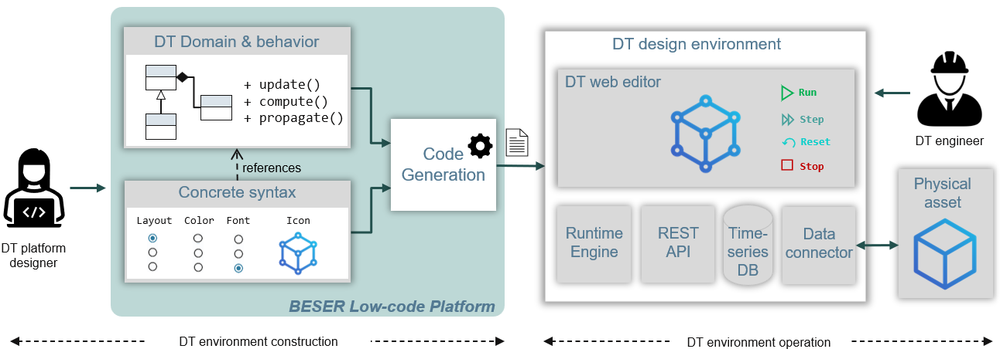
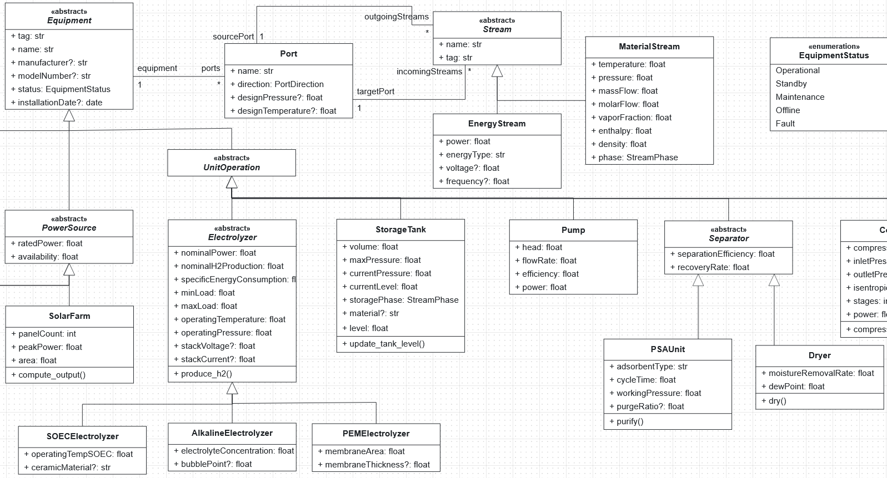
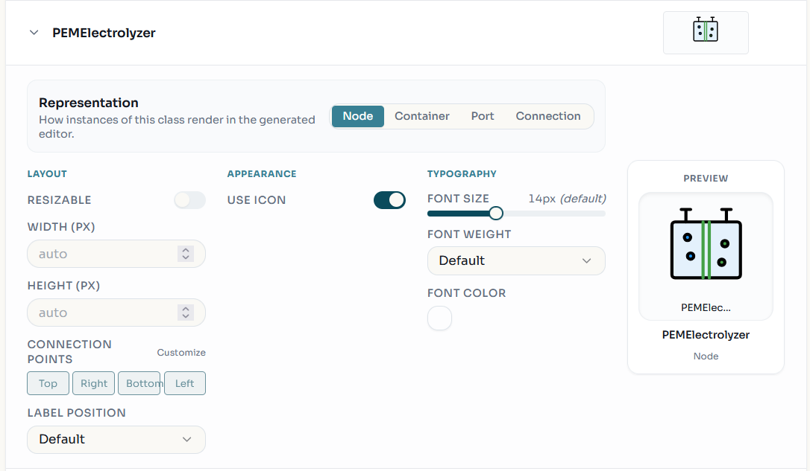
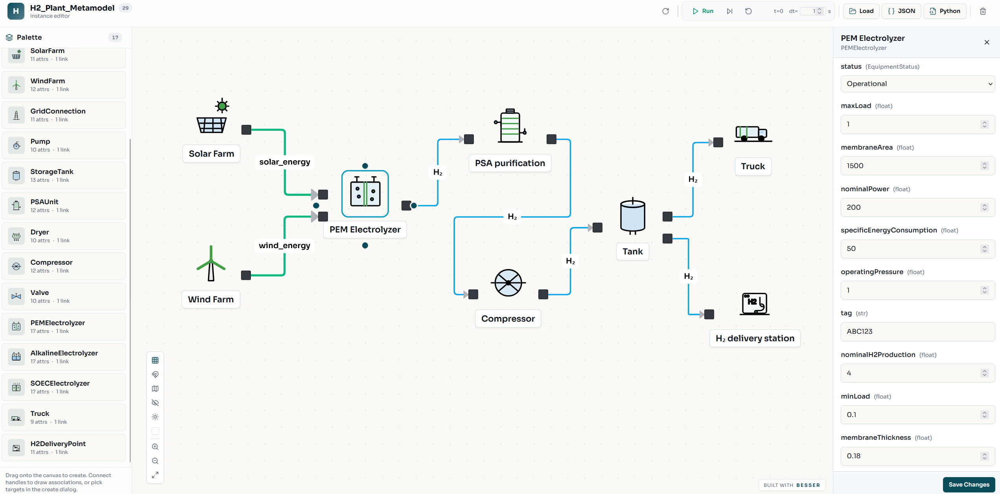
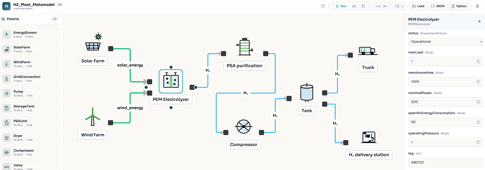

# Generation of Digital Twin Design Environments with BESSER

> **Tool Demo — EDTConf 2026**
> This repository accompanies the tool demonstration paper *"Generation of Digital Twin Design Environments with BESSER"* submitted to the EDTConf 2026.

## Overview

This repository is a fork of the [BESSER](https://github.com/BESSER-PEARL/BESSER) low-code platform extended with a code generator that produces deployable **Digital Twin (DT) Design Environments** from high-level models.

A DT design environment is a full-stack web platform through which engineers can graphically instantiate, configure, simulate, and monitor Digital Twins for a specific domain, without writing any infrastructure code.

### How it works



The approach separates two roles:

- **DT platform designer** — a domain expert who, using the BESSER Web Modeling Editor, specifies three models:
  1. A **class diagram** defining the abstract syntax of the DT domain (classes, attributes, associations, methods)
  2. **Method definitions** providing the operational semantics (Python methods inside the classes that drive the simulation)
  3. A **Concrete Syntax** defining the graphical concrete syntax (icons, layout, appearance) for each domain element

- **DT engineer** — uses the generated web environment to assemble a DT topology, configure component properties, and drive the simulation

The BESSER code generator transforms these three models into a fully deployable DT design environment:

| Layer | Technology | Description |
|-------|-----------|-------------|
| Frontend | React + TypeScript | Visual canvas to drag, connect, and inspect DT instances |
| Backend | FastAPI (Python) | REST API exposing all platform services |
| Runtime Engine | — | Simulation heartbeat: invokes class methods at each tick, keeps frontend synchronized |
| Data Connector | MQTT | Bridges live sensor data from physical assets to DT object properties |
| History store | InfluxDB | Persists the evolution of system states over time |

> For general documentation on BESSER (installation, SDK, generators, metamodels), refer to the **[official BESSER repository](https://github.com/BESSER-PEARL/BESSER)** and its **[documentation](https://besser.readthedocs.io/)**.

---

## Repository Contents

```
BESSER4DT/
├── besser/                         # BESSER platform (extended with DT generation support)
│   └── utilities/web_modeling_editor/
│       ├── backend/                # FastAPI backend (generators, converters, validators)
│       └── frontend/               # Web modeling editor UI (submodule → ivan-alfonso/BESSER-WME-DT)
└── LuxHyVal/                       # Demo use case: H2Plant (green hydrogen production plant)
    ├── H2PlantDSL.json             # BESSER project: class diagram + Platform Customization Diagram
    ├── DT-instances.json           # Pre-built H2Plant DT instance set (ready to import)
    └── DT-desing-env.zip           # Generated DT design environment (ready to deploy)
```

### LuxHyVal — The H2Plant Demo

The `LuxHyVal/` folder contains everything needed to reproduce the paper's running example: a DT design environment for a **photovoltaic-powered green hydrogen production plant**, inspired by the [Luxembourg Hydrogen Valley (LuxHyVal)](https://luxhyval.eu/) project.

| File | Description |
|------|-------------|
| `H2PlantDSL.json` | BESSER project with two diagrams: the `H2_Plant_Metamodel` class diagram (classes such as `SolarFarm`, `PEMElectrolyzer`, `StorageTank`, `Compressor`, `Valve`, `MaterialStream`, `Port`, and their simulation methods) and the Platform Customization Diagram (graphical concrete syntax per class) |
| `DT-instances.json` | Ready-to-import instance set representing a concrete hydrogen plant configuration (PEM Electrolyzer, material/energy streams, PSA unit, ports, and their associations) |
| `DT-desing-env.zip` | Full-stack DT design environment generated from the models above (FastAPI + React + InfluxDB + MQTT via Mosquitto) |

---

## Step 1 — Deploy the BESSER Modeling Editor

Clone this repository (including the frontend submodule) and start the full BESSER stack:

```bash
git clone --recurse-submodules https://github.com/ivan-alfonso/BESSER4DT.git
cd BESSER4DT
docker compose up --build
```

Once running, open the BESSER Web Modeling Editor in your browser:

```
http://localhost:3000
```

> **Note:** If you cloned without `--recurse-submodules`, initialize the frontend submodule manually:
> ```bash
> git submodule update --init --recursive
> ```


---

## Step 2 — Load the H2PlantDSL Project

1. In the BESSER editor, click **"Import Project"** (or the upload icon in the toolbar).
2. Select the file `LuxHyVal/H2PlantDSL.json`.
3. The project loads with two diagrams:
   - **Class Diagram** — the `H2_Plant_Metamodel` structural model with classes, attributes, associations, and simulation methods
   - **Platform Customization Diagram** — the graphical concrete syntax configuration (icons, layout, appearance) for each domain class





---

## Step 3 — Generate the DT Design Environment

With the `H2PlantDSL` project open in the editor:

1. Click **"Generate"** in the editor toolbar.
2. Select the **DT Platform** generator.
3. The editor generates and downloads a ZIP file containing the full-stack DT design environment.

> The pre-generated output is already included at `LuxHyVal/DT-desing-env.zip` — skip to Step 4 to deploy it directly.


---

## Step 4 — Deploy the Generated DT Design Environment

Extract the ZIP and start it with Docker Compose:

```bash
cd LuxHyVal
unzip DT-desing-env.zip -d DT-design-env
cd DT-design-env
docker compose up --build
```

This starts four services:

| Service | URL | Description |
|---------|-----|-------------|
| Frontend | http://localhost:3000 | Visual DT instance canvas |
| Backend API | http://localhost:8000 | FastAPI REST API + Runtime Engine |
| API Docs | http://localhost:8000/docs | Interactive Swagger UI |
| InfluxDB | http://localhost:8086 | Time-series history store |
| Mosquitto | localhost:1883 | Local MQTT broker for live data bindings (optional) |



---

## Step 5 — Load the DT Instances

Once the platform is running, load the pre-built H2Plant instance set:

1. In the running DT design environment at http://localhost:3000, click **"Import"**.
2. Select `LuxHyVal/DT-instances.json`.
3. The canvas populates with the hydrogen plant topology: PEM Electrolyzer, material and energy streams, PSA unit, ports, and their associations.

From here, the DT engineer can:
- Inspect and edit component properties (e.g., `nominalPower`, `specificEnergyConsumption`) via the property inspector panel
- **Run** the simulation continuously or advance it **Step by step** — the Runtime Engine invokes all class methods at each tick
- **Reset** the simulation to the initial state
- Monitor live values as the system state evolves in real time
- Connect an external MQTT source for live sensor data via the Data Connector

All state changes are recorded in InfluxDB, enabling historical analysis of system behavior.




---

## Stopping the Services

```bash
# Stop the BESSER editor
docker compose down          # run from BESSER4DT/

# Stop the DT design environment
docker compose down          # run from LuxHyVal/DT-design-env/
```

---

## Related Resources

| Resource | Link |
|----------|------|
| BESSER official repository | https://github.com/BESSER-PEARL/BESSER |
| BESSER documentation | https://besser.readthedocs.io/ |
| BESSER web editor (online) | https://editor.besser-pearl.org/ |
| BESSER web editor fork (this repo's submodule) | https://github.com/ivan-alfonso/BESSER-WME-DT |
| LuxHyVal project | https://luxhyval.eu/ |
| BESSER examples | https://github.com/BESSER-PEARL/BESSER-examples |

---

## License

This repository inherits the [MIT License](https://opensource.org/license/MIT) from the BESSER project.
